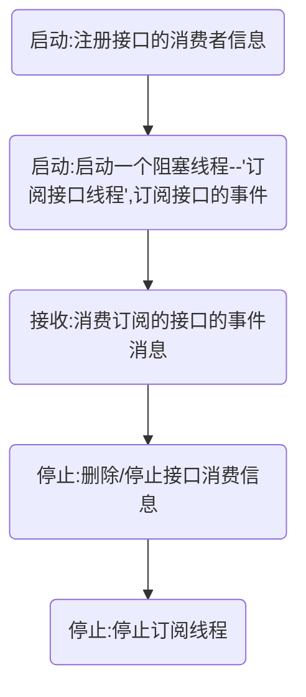
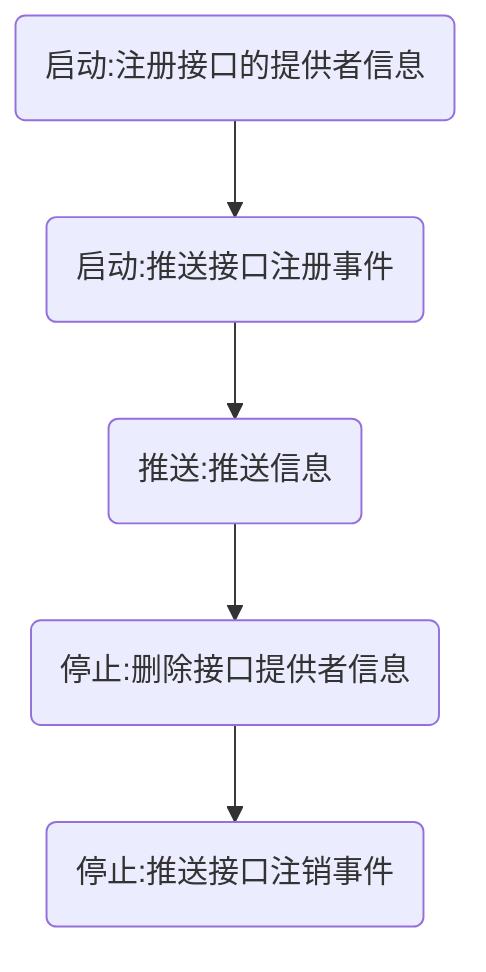

# Dubbo 服务注册机制

## Dubbo所支持的注册中心

1. Multicast 

   组网广播，只可以在局域网内使用，一般只是作为测试

2. Zookeeper (常用)

   是Apache Hadoop 的子项目，是一个树形的目录服务

3. Redis

4. Simple

5. 基于Dubbo 的服务实现(SimpleRegistryService)，不支持集群

## Redis注册中心

- 数据结构：如何存储服务的注册与订阅关系
- 状态更新：当服务状态改变，如何及时更新

### 数据结构：

redis 注册中心使用`Map`存储服务发布，订阅等信息：

```
key:map
	key:value
	key:value
	...
```


发布订阅：

```
/dubbo/{serviceName}/providers
    {providerUrl1}:{periodTimestamp}
    {providerUrl2}:{periodTimestamp}
    ...
```

订阅服务：

```
/dubbo/{serviceName}/consumers
    {consumerUrl1}:{periodTimestamp}
    {consumerUrl2}:{periodTimestamp}
    ...
```

#### 有效期：

这个value值（periodTimestamp）是一种有效期：

provider和consumer发给redis的数据会有一个当前时间+30秒的时间戳作为有效期。要是provider活consumer还“活着”，就会不断“续命”，每次都是+30秒。

[外链图片转存失败,源站可能有防盗链机制,建议将图片保存下来直接上传(img-Tdg1PLgQ-1616348226336)(https://raw.githubusercontent.com/lmafia/private-picture-could/main/20210321190642.png?token=AGSD2IAVWF5RLVNH2EF5M5TAK4UQA)]

##### 相关源码：

在`RedisRegistry`这个类中的有个线程专门来干这个活`expireExecutor`

```java\
ScheduledExecutorService expireExecutor = Executors.newScheduledThreadPool(1, new NamedThreadFactory("DubboRegistryExpireTimer", true));
```

```java
this.expirePeriod = url.getParameter(SESSION_TIMEOUT_KEY, DEFAULT_SESSION_TIMEOUT); //默认是60s
this.expireFuture = expireExecutor.scheduleWithFixedDelay(() -> {
    try {
        deferExpired(); // Extend the expiration time
    } catch (Throwable t) { // Defensive fault tolerance
        logger.error("Unexpected exception occur at defer expire time, cause: " + t.getMessage(), t);
    }
}, expirePeriod / 2, expirePeriod / 2, TimeUnit.MILLISECONDS); //定时每30执行一次
```

`DEFAULT_SESSION_TIMEOUT = 60 * 1000;`
可以看到有效周期默认是60s, 但是dubbo会给自动在有效期的二分之一的时间就发送一次“续命”

```java
if (jedis.hset(key, url.toFullString(), String.valueOf(System.currentTimeMillis() + expirePeriod)) == 1) {
    jedis.publish(key, REGISTER);
}
```

奇怪？不应该是value不应该是+30s吗？

是的，没错。但是你想想每次都是30s执行一次，每次加60s，是不是距离上次的推送的value差值就是30s呢。确实优点绕，但是还是给聪明的我发现了。

#### 发布订阅的流程

##### Consumer



事件:类似topic

###### 相关代码:

1. `RedisRegistry`中的`doRegister`方法注册接口消费者信息;

   - 创建hash表:

     key (接口的url`/dubbo/接口名/consumers`): 

     ​	value(完整的url`dubbo://ip:端口名?参数`): expire(有效期expire);

   - 推送消息`"register"`字符串

2. `doSubscribe`方法创建了`Notifier`线程来调用redis的subscribe方法来阻塞监听事件

   ```java
   jedis.psubscribe(new NotifySub(jedisPool), service); // blocking
   ```

3. 收到消息时,回调`onMessage`,调用`doNotify`进行接收消息

4. 停止注册消费者信息`doUnregister`

5. 停止订阅线程`doUnsubscribe`,redis注册可以不用处理,但是别的注册中心需要;然后进行`destroy`


##### Provider


###### 相关代码:

1. `RedisRegistry`中的`doRegister`方法注册接口提供者信息:

   - 创建hash表:

     key (接口的url`/dubbo/接口名/providers`): 

     ​	value(完整的url`dubbo://ip:端口名?参数`): expire(有效期expire);

   - 推送消息`"register"`字符串

   ```java
   jedis.hset(key, value, expire);
   jedis.publish(key, REGISTER);
   ```

2. `RedisRegistry`中的`doSubscribe`中创建一个`Notifier`线程订阅上面创建的`key`

	```java
	   if (first) {
	       first = false;
	       doNotify(jedis, service);
	       resetSkip();
	   }
	   jedis.psubscribe(new NotifySub(jedisPool), service + PATH_SEPARATOR + ANY_VALUE); // blocking
	```
	第一次的直接调用 `doNotify`
	以后的 `doNotify`都是在`onMessage`方法被调用来处理通知了

3. `doUnregister`

   ```java
   jedis.hdel(key, value);
   jedis.publish(key, UNREGISTER);
   ```

4. `doUnsubscribe`

#### 缺点:

每个服务接口都需要创建一个Notifier线程,因此服务接口数量庞大的时候就需要个更多的线程了.

----

未完：还差zookeeper注册中心分析，还要再把redis的分析再整理下
